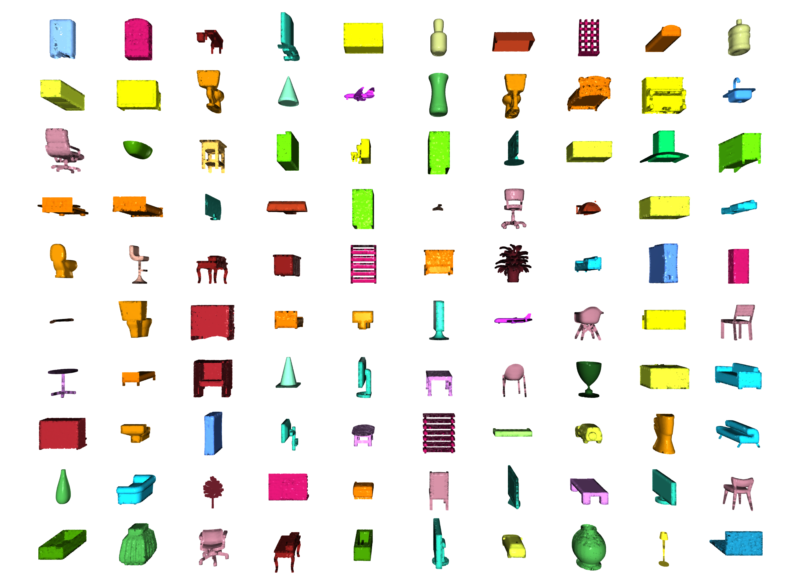
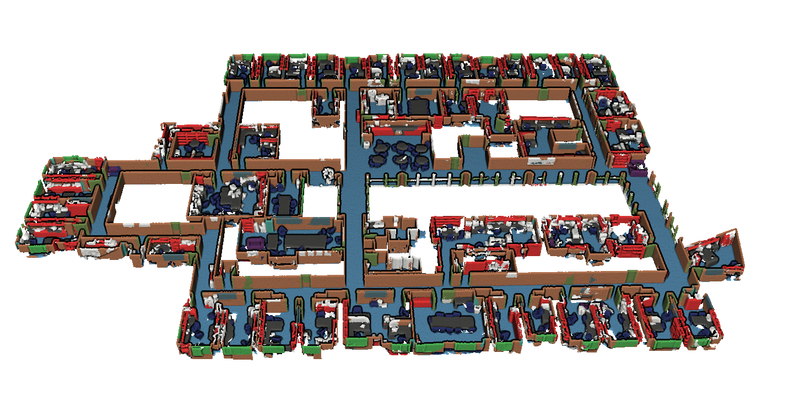
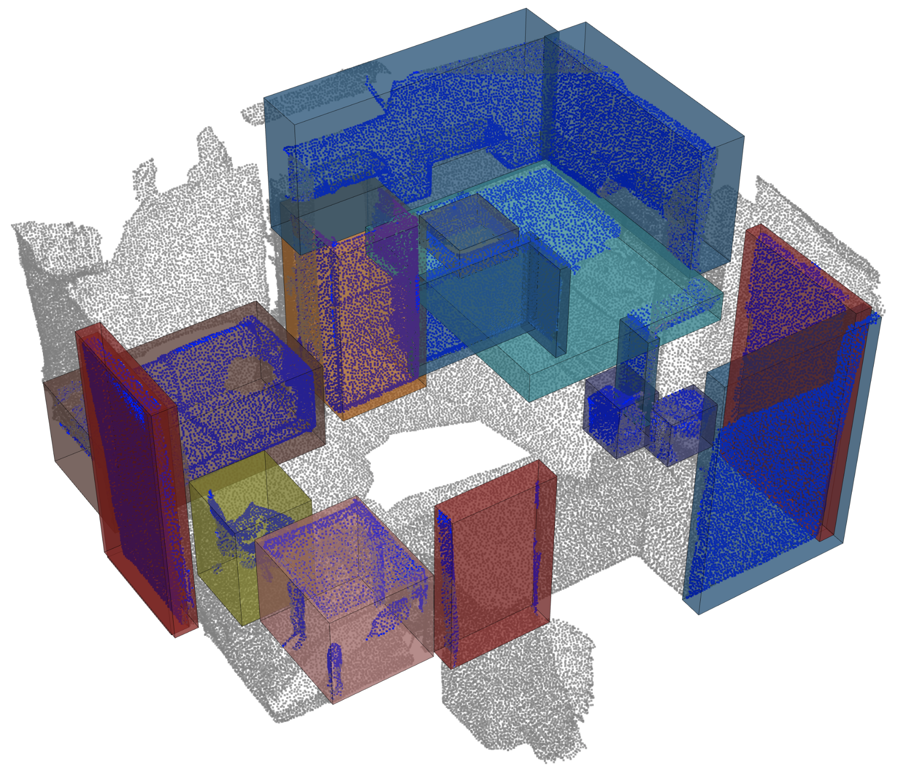
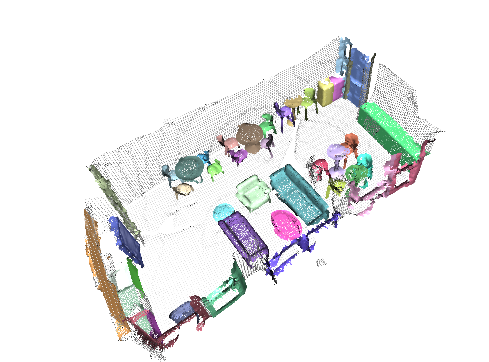
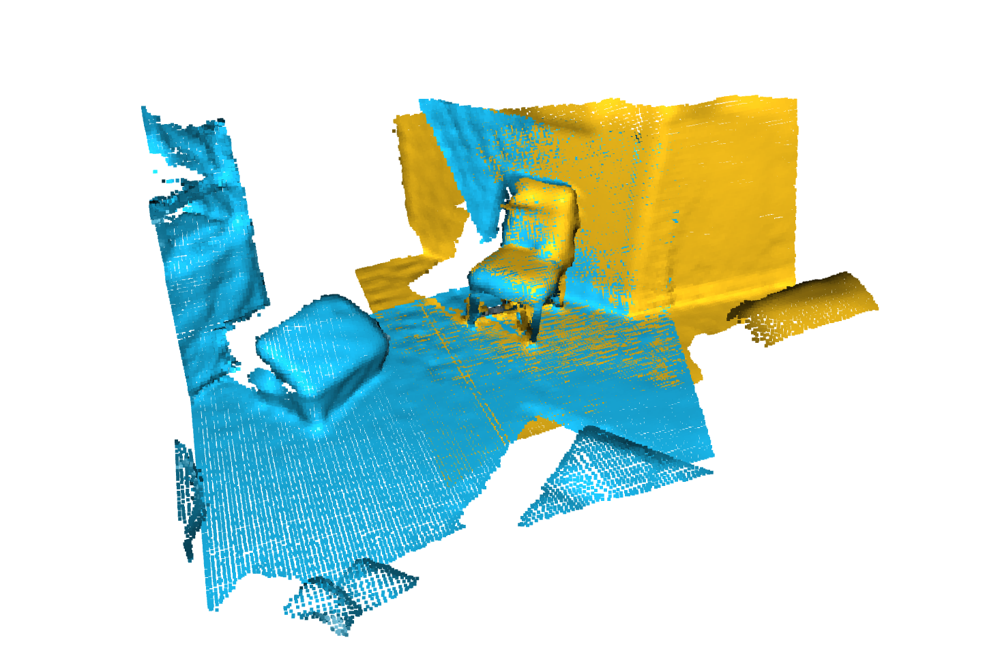

# awesome-pointcloud-sota
Collect and summarize point cloud sota methods.

# Available Tasks

|               <h3> Tasks </h3>                |                      <h3> Examples </h3>                      |
| :-------------------------------------------: | :-----------------------------------------------------------: |
| <h3> Classification </h3> |    |
|            <h3> Segmentation </h3>            |          |
|          <h3> Object Detection </h3>          |                |
|       <h3> Panoptic Segmentation </h3>        |               |
|            <h3> Registration </h3>            |            |
|            <h3> Reconstruction </h3>            |            |
|            <h3> Multi-modal  </h3>            |       pointcloud with language model     |
|            <h3> Change-Detection  </h3>            |       pointcloud change detection     |

# dataset

* [[ModelNet](http://modelnet.cs.princeton.edu/)] ModelNet . [**`classification`**]
* [[scanobjectnn]](https://github.com/hkust-vgd/scanobjectnn) The dataset contains ~15,000 objects that are categorized into 15 categories with 2902 unique object instances [**`classification`**]
* [[ScanNet](http://www.scan-net.org/)] Richly-annotated 3D Reconstructions of Indoor Scenes. [**`classification`** **`segmentation`**]
* [[S3DIS](http://buildingparser.stanford.edu/dataset.html#Download)] The Stanford Large-Scale 3D Indoor Spaces Dataset. [**`segmentation`**]
* [[npm3d]](https://github.com/WeikaiTan/Toronto-3D)  A Large-scale Mobile LiDAR Dataset for Semantic Segmentation of Urban Roadways [**`segmentation`**]  
* [[KITTI-360]](https://www.cvlibs.net/datasets/kitti-360/) Corresponding to over 320k images and 100k laser scans in a driving distance of 73.7km. annotate both static and dynamic 3D scene elements with rough bounding primitives and transfer this information into the image domain, resulting in dense semantic & instance annotations for both 3D point clouds and 2D images. [**`segmentation`**]  
* [[semantic3d]](http://www.semantic3d.net/) Large-Scale Point Cloud Classification Benchmark! a large labelled 3D point cloud data set of natural scenes with over 4 billion points in total. It also covers a range of diverse urban scenes. [**`segmentation`**]
* [SemanticKITTI](http://semantic-kitti.org/) Sequential Semantic Segmentation, 28 classes, for autonomous driving. All sequences of KITTI odometry labeled. [**`segmentation`**]   
* [[ScribbleKITTI]](https://github.com/ouenal/scribblekitti) Choose SemanticKITTI for its current wide use and established benchmark，ScribbleKITTI contains 189 million labeled points corresponding to only 8.06% of the total point count [**`segmentation`**]
* [[STPLS3D]](https://github.com/meidachen/STPLS3D)  a large-scale photogrammetry 3D point cloud dataset, termed Semantic Terrain Points Labeling - Synthetic 3D (STPLS3D), which is composed of high-quality, rich-annotated point clouds from real-world and synthetic environments.[**`segmentation`**]
* [[DALES]](https://udayton.edu/engineering/research/centers/vision_lab/research/was_data_analysis_and_processing/dale.php) A Large-scale Aerial LiDAR Data Set for Point Cloud Segmentation,a new large-scale aerial LiDAR data set with nearly a half-billion points spanning 10 square kilometers of area [**`segmentation`**]
* [[SensatUrban]](https://github.com/QingyongHu/SensatUrban) This dataset is an urban-scale photogrammetric point cloud dataset with nearly three billion richly annotated points, which is five times the number of labeled points than the existing largest point cloud dataset. Our dataset consists of large areas from two UK cities, covering about 6 km^2 of the city landscape. In the dataset, each 3D point is labeled as one of 13 semantic classes, such as ground, vegetation, car, etc.. [**`segmentation`**]
*[[H3D]](https://ifpwww.ifp.uni-stuttgart.de/benchmark/hessigheim/default.aspx) H3D propose a benchmark consisting of highly dense LiDAR point clouds captured at four different epochs. The respective point clouds are manually labeled into 11 classes and are used to derive labeled textured 3D meshes as an alternative representation. UAV-based simultaneous data collection of both LiDAR data and imagery from the same platform,High density LiDAR data of 800 points/m² enriched by RGB colors of on board cameras incorporating a GSD of 2-3 cm [**`segmentation`**]
* [[KITTI]](https://www.cvlibs.net/datasets/kitti/) The KITTI Vision Benchmark Suite. [**`detection`**] 
* [[Waymo]](https://waymo.com/open/data/perception/) The Waymo Open Dataset is comprised of high resolution sensor data collected by Waymo self-driving cars in a wide variety of conditions.[**`detection`** **`segmentation`**] 
* [[APOLLOSCAPE]](https://apolloscape.auto/) The nuScenes dataset is a large-scale autonomous driving dataset.[**`detection`** **`segmentation`**] 
* [[nuScenes]](https://www.nuscenes.org/) The nuScenes dataset is a large-scale autonomous driving dataset.[**`detection`** **`segmentation`**] 
* [[3D Match]](https://3dmatch.cs.princeton.edu/) Keypoint Matching Benchmark, Geometric Registration Benchmark, RGB-D Reconstruction Datasets. [**`registration`**  **`reconstruction`**   ]
* [[ETH]](https://projects.asl.ethz.ch/datasets/doku.php?id=laserregistration:laserregistration) Challenging data sets for point cloud registration algorithms [**`registration`**]
* [[objaverse](https://objaverse.allenai.org/)] Objaverse-XL is an open dataset of over 10 million 3D objects! With it, we train Zero123-XL, a foundation model for 3D, observing incredible 3D generalization abilities.[**`Multi-modal`**]
* [[ScanRfer](https://daveredrum.github.io/ScanRefer/)] 3D Object Localization in RGB-D Scans using Natural Language.[**`Multi-modal`**]
* [[DriveLM](https://github.com/OpenDriveLab/DriveLM)] DriveLM is an autonomous driving (AD) dataset incorporating linguistic information. Through DriveLM, we want to connect large language models and autonomous driving systems, and eventually introduce the reasoning ability of Large Language Models in autonomous driving (AD) to make decisions and ensure explainable planning.
[**`Multi-modal`**]
* [[ScanQA](https://github.com/ATR-DBI/ScanQA)] 3D Question Answering for Spatial Scene Understanding. A new 3D spatial understanding task for 3D question answering (3D-QA). In the 3D-QA task, models receive visual information from the entire 3D scene of a rich RGB-D indoor scan and answer given textual questions about the 3D scene
[**`Multi-modal`**]
* [[urb3dcd-v2](https://ieee-dataport.org/open-access/urb3dcd-urban-point-clouds-simulated-dataset-3d-change-detection)] The dataset is based on LoD2 models of the first and second districts of Lyon, France. To conduct fair qualitative and quantitative evaluation of point clouds change detection techniques. This first version of the dataset is composed of point clouds at a challenging low resolution of around 0.5 points/meter²
[**`Change-Detection`**]

# **task sota**
##  **1. Classification**

| <h3>Model</h3> | <h3>Paper</h3> | <h3>Code</h3> | Year|
| :----:   | :----:|  :----:  |:----:|
| PointView-GCN | [3D shape classification with multi-view point clouds](https://ieeexplore.ieee.org/document/9506426) | [github](https://github.com/SMohammadi89/PointView-GCN)|2021|
| PointGPT | [Auto-regressively Generative Pre-training from Point Clouds](https://arxiv.org/abs/2305.11487) | [github](https://github.com/CGuangyan-BIT/PointGPT)|2023|
| point2vec | [Self-Supervised Representation Learning on Point Clouds](https://arxiv.org/abs/2303.16570) | [github](https://github.com/kabouzeid/point2vec)|2023|
| ULIP2| [Towards Scalable Multimodal Pre-training for 3D Understanding](https://arxiv.org/abs/2305.08275) | [github](https://github.com/salesforce/ulip)|2022|
| ReCon| [Contrast with Reconstruct: Contrastive 3D Representation Learning Guided by Generative Pretraining](https://arxiv.org/abs/2302.02318) | [github](https://github.com/qizekun/ReCon)|2023|
|RepSurf-U|[Surface Representation for Point Clouds](https://arxiv.org/abs/2205.05740)|[github](https://github.com/hancyran/RepSurf)|2022|
| PointMLP| [Rethinking Network Design and Local Geometry in Point Cloud: A Simple Residual MLP Framework](https://arxiv.org/abs/2202.07123) | [github](https://github.com/ma-xu/pointmlp-pytorch)|2022|
| PointNeXt| [PointNeXt: Revisiting PointNet++ with Improved Training and Scaling Strategies](https://arxiv.org/abs/2206.04670) | [github](https://github.com/guochengqian/pointnext)|2022|
| PVT| [Point-Voxel Transformer for Point Cloud Learning](https://arxiv.org/abs/2108.06076) |  [github](https://github.com/HaochengWan/PVT)|2021|
| Point-MAE| [Masked Autoencoders for Point Cloud Self-supervised Learning](https://arxiv.org/abs/2203.06604) |  [github](https://github.com/Pang-Yatian/Point-MAE)|2022|
| Point-M2AE| [Multi-scale Masked Autoencoders for Hierarchical Point Cloud Pre-training](https://arxiv.org/pdf/2205.14401.pdf) |  [github](https://github.com/ZrrSkywalker/Point-M2AE)|2022|
| Point-BERT| [Pre-Training 3D Point Cloud Transformers with Masked Point Modeling](https://arxiv.org/abs/2111.14819) |  [github](https://github.com/lulutang0608/Point-BERT)|2021|
| PCT | [Point Cloud Transformer](https://arxiv.org/pdf/2012.09688.pdf) |  [github](https://github.com/MenghaoGuo/PCT)| 2020 |

## **2. Segmentation**

| <h3>Model</h3> | <h3>Paper</h3> | <h3>Code</h3> | Year|
| :----:   | :----:|  :----:  |:----:|
| *PointTransformerV3* | [Point Transformer V3: Simpler, Faster, Stronger](https://arxiv.org/pdf/2312.10035.pdf) | [github](https://github.com/Pointcept/Pointcep)| 2023 |
| PonderV2 | [PonderV2: Pave the Way for 3D Foundation Model with A Universal Pre-training Paradigm](https://arxiv.org/abs/2310.08586) | [github](https://github.com/OpenGVLab/PonderV2)| 2023 |
| Swin3D | [A Pretrained Transformer Backbone for 3D Indoor Scene Understanding](https://arxiv.org/pdf/2304.06906v2.pdf) | [github](https://github.com/Yukichiii/Swin3D_Task)| 2023 |
| Multi-dataset Point Prompt Training | [PPT:Towards Large-scale 3D Representation Learning with Multi-dataset Point Prompt Training](https://arxiv.org/abs/2308.09718) | [github](https://github.com/Pointcept/Pointcept#point-prompt-training-ppt)| 2023 |
| SphereFormer | [Spherical Transformer for LiDAR-based 3D Recognition](https://arxiv.org/pdf/2012.09688.pdf) |  [github](https://github.com/dvlab-research/sphereformer)| 2023 |
| RangeFormer | [Rethinking Range View Representation for LiDAR Segmentation](https://arxiv.org/abs/2303.05367) |  [--]()| 2023 |
| Window-Normalization | [Window Normalization: Enhancing Point Cloud Understanding by Unifying Inconsistent Point Densities](https://arxiv.org/abs/2212.02287) |  [github](https://github.com/DBDXSS/Window-Normalization)| 2022 |
| ptv2 | [Point Transformer V2: Grouped Vector Attention and Partition-based Pooling](https://arxiv.org/abs/2210.05666) |  [github](https://github.com/Pointcept/Pointcept)| 2022 |
| stratified-transformer | [Stratified Transformer for 3D Point Cloud Segmentation](https://arxiv.org/pdf/2203.14508.pdf) |  [github](https://github.com/dvlab-research/stratified-transformer)| 2022 |
| Superpoint Transformer | [Efficient 3D Semantic Segmentation with Superpoint Transformer](https://arxiv.org/abs/2306.08045) |  [github](https://github.com/drprojects/superpoint_transformer)| 2023 |
| pointnext | [PointNeXt: Revisiting PointNet++ with Improved Training and Scaling Strategies](https://arxiv.org/abs/2206.04670) |  [github](https://github.com/guochengqian/pointnext)| 2022 |
| RepSurf | [Surface Representation for Point Clouds](https://arxiv.org/abs/2205.05740) |  [github](https://github.com/hancyran/RepSurf)| 2022 |
| CBL | [ Contrastive Boundary Learning for Point Cloud Segmentation](https://arxiv.org/abs/2203.05272) |  [github](https://github.com/liyaotang/contrastboundary)| 2022 |
| FastPointTransformer | [Fast Point Transformer](https://arxiv.org/abs/2112.04702) |  [github](https://github.com/POSTECH-CVLab/FastPointTransformer)| 2022 |
| PVKD  | [Point-to-Voxel Knowledge Distillation for LiDAR Semantic Segmentation](https://arxiv.org/abs/2206.02099) |  [github](https://github.com/cardwing/Codes-for-PVKD)| 2022 |
| Cylinder3D | [Cylindrical and Asymmetrical 3D Convolution Networks for LiDAR Segmentation](https://arxiv.org/abs/2008.01550) |  [github](https://github.com/xinge008/Cylinder3D)| 2020 |
| RandLA-Net | [ RandLA-Net: Efficient Semantic Segmentation of Large-Scale Point Clouds](https://arxiv.org/abs/1911.11236) |  [github](https://github.com/QingyongHu/RandLA-Net)| 2020 |
| KPConv | [ KPConv: Flexible and Deformable Convolution for Point Clouds](https://arxiv.org/abs/1904.08889) |  [github](https://github.com/HuguesTHOMAS/KPConv-PyTorch)| 2019 |

## **3. Detection**

| <h3>Model</h3> | <h3>Paper</h3> | <h3>Code</h3> | Year|
| :----:   | :----:|  :----:  |:----:|
| DSVT | [Dynamic Sparse Voxel Transformer with Rotated Sets](https://arxiv.org/abs/2301.06051) |  [github](https://github.com/haiyang-w/dsvt)| 2023 |
| Pillar R-CNN | [Pillar R-CNN for Point Cloud 3D Object Detection](https://arxiv.org/pdf/2302.13301.pdf) |  [github](https://github.com/VISION-SJTU/PillarNet-LTS)| 2023 |
| TransFusion  | [Robust LiDAR-Camera Fusion for 3D Object Detection with Transformers](https://arxiv.org/abs/2203.11496) |  [github](https://github.com/xuyangbai/transfusion)| 2022 |
| CenterFormer  | [CenterFormer: Center-based Transformer for 3D Object Detection](https://arxiv.org/abs/2209.05588) |  [github](https://github.com/tusimple/centerformer)| 2022 |
|CenterPoint| [Center-based 3D Object Detection and Tracking](https://arxiv.org/abs/2006.11275) |  [github](https://github.com/tianweiy/CenterPoint)| 2020 |
| TR3D  | [Towards Real-Time Indoor 3D Object Detection](https://arxiv.org/abs/2302.02858) |  [github](https://github.com/samsunglabs/tr3d)| 2023 |
| PV-RCNN++  | [Point-Voxel Feature Set Abstraction With Local Vector Representation for 3D Object Detection](https://arxiv.org/pdf/2102.00463.pdf) |  [github](https://github.com/open-mmlab/OpenPCDet)| 2021 |

## **4. Panoptic Segmentation**
| <h3>Model</h3> | <h3>Paper</h3> | <h3>Code</h3> | Year|
| :----:   | :----:|  :----:  |:----:|
| P3Former | [Position-Guided Point Cloud Panoptic Segmentation Transformer](https://arxiv.org/abs/2303.13509) |  [github](https://github.com/smartbot-pjlab/p3former)| 2023 |
| ISBNet | [a 3D Point Cloud Instance Segmentation Network with Instance-aware Sampling and Box-aware Dynamic Convolution](https://arxiv.org/abs/2303.00246) |  [github](https://github.com/VinAIResearch/ISBNet)| 2023 |
| Mask3D | [Mask Transformer for 3D Instance Segmentation](https://arxiv.org/abs/2210.03105) |  [github](https://github.com/jonasschult/mask3d)| 2022 |

## **5. registration**
| <h3>Model</h3> | <h3>Paper</h3> | <h3>Code</h3> | Year|
| :----:   | :----:|  :----:  |:----:|
| IMFNet | [Interpretable Multimodal Fusion for Point Cloud Registration](https://arxiv.org/abs/2111.09624) |  [github](https://github.com/XiaoshuiHuang/IMFNet)| 2022 |
| gedi | [Learning general and distinctive 3D local deep descriptors for point cloud registration](https://arxiv.org/pdf/2105.10382.pdf) |  [github](https://github.com/fabiopoiesi/gedi)| 2022 |
| GeoTransformer | [Geometric Transformer for Fast and Robust Point Cloud Registration](https://arxiv.org/abs/2202.06688) |  [github](https://github.com/qinzheng93/geotransformer)| 2022 |
| D3Feat | [Joint Learning of Dense Detection and Description of 3D Local Features](https://arxiv.org/abs/2003.03164) |  [github](https://github.com/XuyangBai/D3Feat)| 2020 |

## **6. reconstruction**
| <h3>Model</h3> | <h3>Paper</h3> | <h3>Code</h3> | Year|
| :----:   | :----:|  :----:  |:----:|
| PoinTr | [PoinTr: Diverse Point Cloud Completion with Geometry-Aware Transformers](https://arxiv.org/abs/2108.08839) |  [github](https://github.com/yuxumin/PoinTr)| 2023 |
| MaskSurf | [Masked Surfel Prediction for Self-Supervised Point Cloud Learning](https://arxiv.org/pdf/2207.03111.pdf) |  [github](https://github.com/ybzh/masksurf)| 2022 

## **7. multi-modal**
| <h3>Model</h3> | <h3>Paper</h3> | <h3>Code</h3> | Year|
| :----:   | :----:|  :----:  |:----:|
| 3D-LLM | [3D-LLM: Injecting the 3D World into Large Language Models](https://arxiv.org/abs/2307.12981) |  [github](https://github.com/UMass-Foundation-Model/3D-LLM)| 2023 |
| PointLLM | [PointLLM: Empowering Large Language Models to Understand Point Clouds](https://arxiv.org/abs/2308.16911) |  [github](https://github.com/OpenRobotLab/PointLLM)| 2023 

## **8. change-detection**
| <h3>Model</h3> | <h3>Paper</h3> | <h3>Code</h3> | Year|
| :----:   | :----:|  :----:  |:----:|
| DC3DCD | [unsupervised learning for multiclass 3D point cloud change detection](https://arxiv.org/pdf/2305.05421.pdf) |  [github](https://github.com/idegelis/torch-points3d-dc3dcd)| 2023 |
| Siamese KPConv | [3D multiple change detection from raw point clouds using deep learning](https://www.sciencedirect.com/science/article/abs/pii/S0924271623000394) |  [github](https://github.com/IdeGelis/torch-points3d-SiameseKPConv)| 2023 |
|  A Review| [Three Dimensional Change Detection Using Point Clouds: A Review](https://www.mdpi.com/2673-7418/2/4/25) |  [github](-)| 2022 |

 # open libs

 * [[**Pointcept**]](https://github.com/Pointcept/Pointcept)  
 Pointcept is a powerful and flexible codebase for point cloud perception research. (**recommend**)

* [[**mmdetection3d**]](https://github.com/open-mmlab/mmdetection3d)  
  MMDetection3D is an open source object detection toolbox based on PyTorch, towards the next-generation platform for general 3D detection. It is a part of the OpenMMLab project developed by MMLab.

  * **Support multi-modality/single-modality detectors out of box**

  It directly supports multi-modality/single-modality detectors including MVXNet, VoteNet, PointPillars, etc.

  * **Support indoor/outdoor 3D detection out of box**

  It directly supports popular indoor and outdoor 3D detection datasets, including ScanNet, SUNRGB-D, Waymo, nuScenes, Lyft, and KITTI. For nuScenes dataset, we also support nuImages dataset.

  * **Natural integration with 2D detection**

  All the about **300+ models, methods of 40+ papers**, and modules supported in MMDetection can be trained or used in this codebase.

  * **High efficiency**

    

* [[**open3d**]](https://github.com/isl-org/Open3D)  
  Open3D is an open-source library that supports rapid development of software that deals with 3D data. The Open3D frontend exposes a set of carefully selected data structures and algorithms in both C++ and Python. The backend is highly optimized and is set up for parallelization. Open3D was developed from a clean slate with a small and carefully considered set of dependencies. It can be set up on different platforms and compiled from source with minimal effort. The code is clean, consistently styled, and maintained via a clear code review mechanism. Open3D has been used in a number of published research projects and is actively deployed in the cloud. 

    Core features
    * Simple installation via conda and pip
    * 3D data structures
    * 3D data processing algorithms
    * Scene reconstruction
    * Surface alignment
    * PBR rendering
    * 3D visualization
    * Python binding

* [[**OpenPCDet**]](https://github.com/open-mmlab/OpenPCDet)  
OpenPCDet is a clear, simple, self-contained open source project for LiDAR-based 3D object detection.
It is also the official code release of [PointRCNN], [Part-A2-Net], [PV-RCNN], [Voxel R-CNN], [PV-RCNN++] and [MPPNet].

* [[**torch-points3d**]](https://github.com/torch-points3d/torch-points3d)

    Torch Points 3D is a framework for developing and testing common deep learning models to solve tasks related to unstructured 3D spatial data i.e. Point Clouds. The framework currently integrates some of the best published architectures and it integrates the most common public datasests for ease of reproducibility. It heavily relies on Pytorch Geometric and Facebook Hydra library thanks for the great work!

* [[**learning3d**]](https://github.com/vinits5/learning3d)

    Learning3D is an open-source library that supports the development of deep learning algorithms that deal with 3D data. The Learning3D exposes a set of state of art deep neural networks in python. A modular code has been provided for further development. We welcome contributions from the open-source community.

* [[**CloudCompare**]](https://www.danielgm.net/cc/)

  CloudCompare is a 3D point cloud (and triangular mesh) processing software. It was originally designed to perform comparison between two 3D points clouds (such as the ones obtained with a laser scanner) or between a point cloud and a triangular mesh. It relies on an octree structure that is highly optimized for this particular use-case. It was also meant to deal with huge point clouds (typically more than 10 million points, and up to 120 million with 2 GB of memory).
